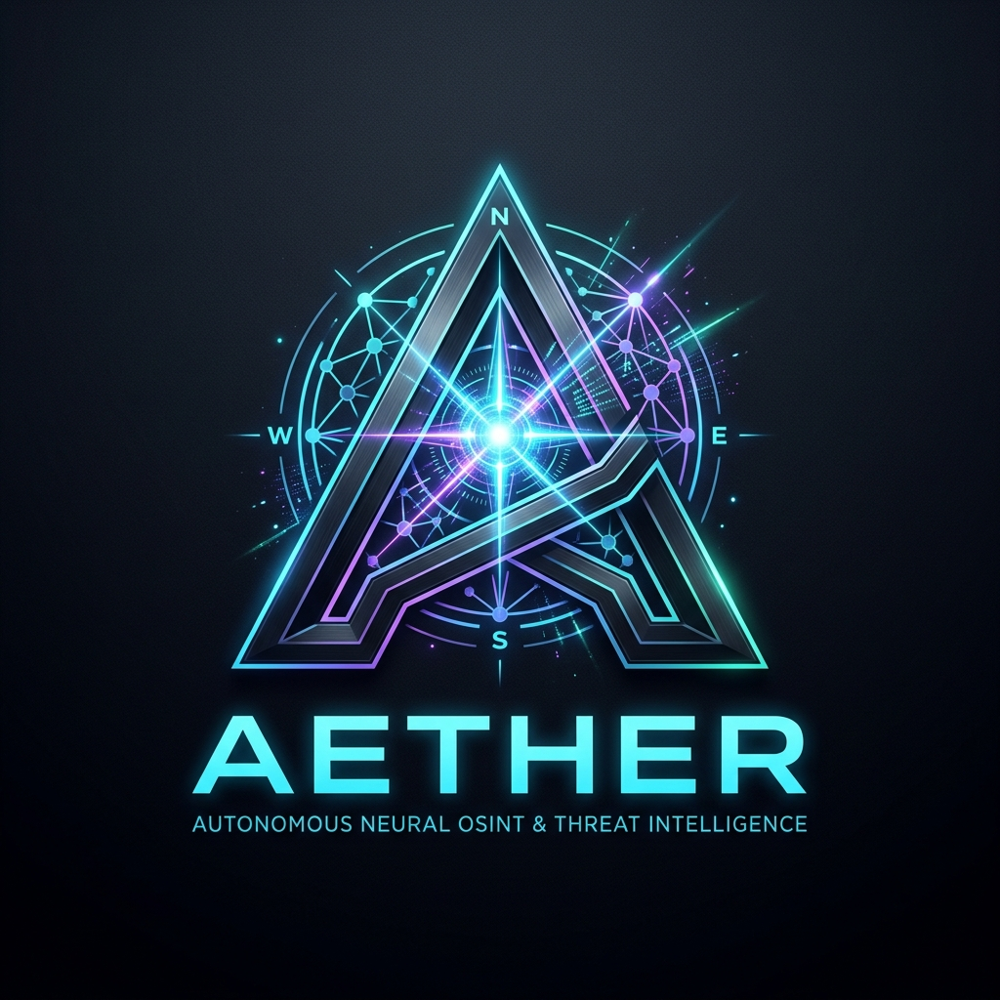

<div align="center" dir="rtl">



# 🌐 پلتفرم هوشمند AETHER نسخه ۴.۰
### اپراتور شناختی و خودمختار سایبری، تحلیل چندحالتی و OSINT پیشرفته

[](https://python.org)
[](https://fastapi.tiangolo.com)
[](https://ollama.com)
[-10b981?style=for-the-badge&logo=pytest&logoColor=white)](https://pytest.org)
[](https://github.com/ark4ng3l/aether)
[](LICENSE)

<br/>

**🌍 زبان‌ها / Languages / Языки / 语言:**  
[English](README.md) • [فارسی (Persian)](README.fa.md) • [Русский (Russian)](README.ru.md) • [中文 (Chinese)](README.zh.md)

<br/>

[⚡ راه‌اندازی سریع](#-راهاندازی-سریع-و-اجرا) •
[🧠 معماری چندعاملی سلسله‌مراتبی](#-معماری-چندعاملی-سلسلهمراتبی-v40) •
[🩺 موتور خودترمیمی شناختی](#-موتور-خودترمیمی-و-خطایابی-شناختی) •
[🛡️ سندباکس دو سطحی](#-سندباکس-دو-سطحی-سنتز-ابزار) •
[🗺️ ادراک چندحالتی (تصویر/صوت/ژئو)](#-ادراک-چندحالتی-و-خطوط-لوله-اطلاعاتی) •
[📊 گراف دانش GraphRAG](#-گراف-دانش-graphrag-و-ترکیب-حافظه) •
[🌐 رابط کاربری چندزبانه](#-رابط-کاربری-چندزبانه-و-پشتیبانی-از-فارسی)

<br/>

```ascii
     ___      ______ _____ _    _ ______ _____  
    / _ \    |  ____|_   _| |  | |  ____|  __ \ 
   / /_\ \   | |__    | | | |__| | |__  | |__) |
  / / _ \ \  |  __|   | | |  __  |  __| |  _  / 
 / / / \ \ \ | |____ _| |_| |  | | |____| | \ \ 
/_/ /   \_\_\|______|_____|_|  |_|______|_|  \_\
      موتور شناختی و هوشمند سایبری // نسخه ۴.۰
```

</div>

---

## 🌟 معرفی و نمای کلی

**AETHER v4.0** یک پلتفرم پیشرفته و کاملاً خودمختار برای تحلیل تهدیدات سایبری، شناسایی منبع‌باز (OSINT پسیو)، پردازش داده‌های چندحالتی (تصویر، صوت و نقشه) و استنتاج سلسله‌مراتبی است. این سیستم بدون نیاز به کلیدهای API خارجی یا ارسال داده به سرورهای ابری، **۱۰۰٪ به صورت محلی بر بستر مدل‌های عصبی Ollama** اجرا شده و امنیت عملیاتی (OPSEC) را به طور کامل تضمین می‌کند.

چرخه تفکر و استنتاج چندعاملی در AETHER:

$$\text{تعریف هدف} \longrightarrow \text{برنامه‌ریزی Tree-of-Thought} \longrightarrow \text{توزیع موازی میان متخصصان} \longrightarrow \text{خودترمیمی در لحظه} \longrightarrow \text{ارزیابی منتقد (Critic)} \longrightarrow \text{تولید پرونده اطلاعاتی GraphRAG}$$

---

## 🧠 معماری چندعاملی سلسله‌مراتبی (v4.0)

این سیستم بر پایه الگوی **Commander-Specialist-Critic** طراحی شده است:

1. **عامل فرمانده (`CommanderAgent`)**:
   - تفکیک مأموریت‌های سطح بالا به گراف‌های وظایف وابسته با استدلال درخت افکار (Tree-of-Thought).
   - هدایت و نظارت بر اجرای موازی و ناهمگام وظایف توسط عامل‌های تخصصی.
2. **عامل‌های تخصصی (`Specialists`)**:
   - **`NetworkSpecialist`**: بررسی تغییرات دامنه (Typosquatting)، مسیریابی BGP/ASN، گواهی‌های SSL/TLS، تحلیل فناوری‌های هدف و کشف باکت‌های ابری.
   - **`VisionSpecialist`**: استخراج متادیتا و مختصات GPS از تصاویر (EXIF)، خوانش متن (OCR) و تحلیل بصری محیطی.
   - **`AudioSpecialist`**: پیاده‌سازی صوت با Whisper، استخراج نام‌ها و علائم صوتی.
   - **`ToolmakerSpecialist`**: برنامه‌نویسی و سنتز خودکار ابزارهای جدید پایتون در لحظه تحت بررسی امنیتی AST.
3. **ارزیاب امنیتی رقیب (`RedTeamCritic`)**:
   - نقد و ارزیابی شواهد برای جلوگیری از توهم مدل (Hallucination) و داده‌های نامعتبر قبل از ورود به گراف دانش.

---

## 🩺 موتور خودترمیمی و خطایابی شناختی (Self-Healing Engine)

در صورتی که اجرای یک ابزار به دلیل موانع امنیتی (مثل WAF، خطای ۴۲۹ Cloudflare)، فرمت اشتباه پارامترها یا قطعی سرور با خطا مواجه شود:

- **تحلیل ریشه‌ای علت خطا (RCA)**: خطایابی هوشمند در ۶ دسته مجزا (`INPUT_FORMAT_ERROR`, `RATE_LIMITED_OR_BLOCKED`, `TARGET_UNREACHABLE`, `TOOL_DEFICIENCY`, `CRITIC_REJECTION`, `UNKNOWN_TRANSIENT`).
- **تبدیل خودکار پارامترها**: استخراج خودکار نام دامنه از URL، تصحیح پورت‌ها و حذف پیشوندهای اضافی.
- **تغییر استراتژی به مخازن پسیو**: تغییر آنی مسیر عملیات به منابع غیرمستقیم (آرشیو اینترنت Wayback، پایگاه‌های عمومی DNS و آرشیو BGP) در صورت مسدود بودن تارگت.
- **حافظه یادگیری شکست (Episodic Memory)**: ثبت راهکارهای موفق برای رفع پیش‌دستانه خطاهای مشابه در مأموریت‌های آینده.

---

## 🛡️ سندباکس دو سطحی سنتز ابزار

کدهای پایتونی که توسط عامل سنتز ابزار (`ToolmakerSpecialist`) تولید می‌شوند از دو لایه حفاظتی عبور می‌کنند:

1. **تحلیلگر استاتیک AST ([`sandbox.py`](file:///d:/project/aether/perception/tools/sandbox.py))**: مسدودسازی ماژول‌های سیستمی مخرب (`os`, `sys`, `subprocess`, `socket`) و توابع خطرناک توکار.
2. **مجری ایزوله Subprocess ([`sandbox_runner.py`](file:///d:/project/aether/core/sandbox_runner.py))**: اجرای کدها در پروسه مستقل با متغیرهای محیطی پاک‌سازی‌شده، محدودیت منابع سخت‌افزاری (۲۵۶ مگابایت رم، ۱۰ ثانیه CPU) و سقف زمانی مشخص (Timeout).

---

## 🌐 رابط کاربری چندزبانه و پشتیبانی از فارسی

داشبورد AETHER به صورت کامل از زبان‌های زیر به همراه تغییر جهت استاندارد راست‌به‌چپ (RTL) پشتیبانی می‌کند:
- 🇮🇷 **فارسی (Persian)** — به همراه تایپوگرافی فونت وزیرمتن و لایه‌بندی راست‌به‌چپ
- 🇺🇸 **English**
- 🇷🇺 **Русский (Russian)**
- 🇨🇳 **中文 (Chinese)**

---

## ⚡ راه‌اندازی سریع و اجرا

### پیش‌نیازها
- پایتون ۳.۱۱ یا بالاتر
- نرم‌افزار [Ollama](https://ollama.com) با مدل‌های `qwen2.5:7b` یا `qwen2.5-coder:7b`

### ۱. نصب وابستگی‌ها
```bash
git clone https://github.com/ark4ng3l/aether.git
cd aether
pip install -r requirements.txt
```

### ۲. اجرای سرور و داشبورد
```bash
python run.py
```

لینک ورود یک‌بارمصرف همراه با توکن امنیتی در ترمینال چاپ خواهد شد:
```text
[bold green]================================================================[/bold green]
[bold green]  AETHER v4.0 — Autonomous Cyber-Intelligence Operator Ready    [/bold green]
[bold cyan]  Access UI at: http://127.0.0.1:8000/#token=<SECURE_SESSION_TOKEN>[/bold cyan]
[bold green]================================================================[/bold green]
```

لینک فوق را در مرورگر باز کنید تا به داشبورد دسترسی پیدا کنید.

---

## 🧪 اجرای آزمون‌های خودکار

برای اجرای تمام ۱۴۳ تست پروژه و تایید سلامت عملکرد:
```bash
python -m pytest tests/ -v
```

```text
================= 143 passed in 133.95s (100% Success) =================
```

---

## 📄 مجوز استفاده

این پروژه تحت مجوز [MIT License](LICENSE) منتشر شده است. استفاده از این نرم‌افزار صرفاً برای اهداف دفاعی، ممیزی امنیتی مجاز و پژوهش‌های اطلاعاتی بر بستر داده‌های عمومی مجاز می‌باشد.
