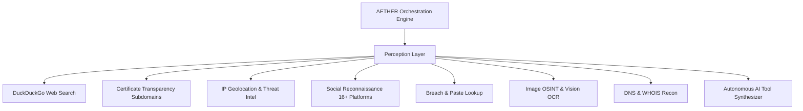

<div align="center">

# 🌐 AETHER
### Autonomous Extraction, Tactical Heuristic Exploration & Resolution
**Next-Generation Cyber Intelligence, Vision OSINT & Autonomous Reasoning Platform**

[](https://python.org)
[](https://fastapi.tiangolo.com)
[](https://ollama.com)
[-10b981?style=for-the-badge&logo=pytest&logoColor=white)](https://pytest.org)
[](https://oasis-open.github.io/cti-documentation/)
[](LICENSE)

<br/>

[⚡ Live Web Dashboard](#-quickstart--launching) •
[🧠 Neural Architecture](#-neural-models--vram-arbitration) •
[🛠 Perception & Tool Arsenal](#-perception-layer--tool-arsenal) •
[🗺️ Geo-OSINT & Image Forensics](#-visual-forensics--geo-osint) •
[🤖 AI Tool Synthesizer](#-autonomous-tool-synthesis-ai-toolmaker) •
[📖 API Reference](#-rest--websocket-api-reference)

<br/>

```ascii
     ___      ______ _____ _    _ ______ _____  
    / _ \    |  ____|_   _| |  | |  ____|  __ \ 
   / /_\ \   | |__    | | | |__| | |__  | |__) |
  / / _ \ \  |  __|   | | |  __  |  __| |  _  / 
 / / / \ \ \ | |____ _| |_| |  | | |____| | \ \ 
/_/ /   \_\_\|______|_____|_|  |_|______|_|  \_\
      AUTONOMOUS INTELLIGENCE ENGINE // v2.0
```

</div>

---

## 🌟 Executive Overview

**AETHER** is an enterprise-grade autonomous cyber intelligence, visual reconnaissance, and open-source intelligence (OSINT) investigation framework. It completely automates multi-source investigations through a closed-loop multi-agent cognitive cycle:

$$\text{Observation} \longrightarrow \text{Graph-of-Thoughts Planning} \longrightarrow \text{Multi-Modal Tool Execution} \longrightarrow \text{Adversarial Refutation} \longrightarrow \text{Dossier & STIX Synthesis}$$

Operating **100% locally via Ollama**, AETHER ensures total operational security (OPSEC) and data privacy with zero third-party telemetry or cloud leakage.

---

## 🧠 Neural Models & VRAM Arbitration

AETHER employs a specialized hierarchy of **6 local uncensored models**, dynamically arbitrated by a hardware-aware VRAM Lock manager to run seamlessly on single-GPU workstations (e.g., NVIDIA RTX 4070 8GB/12GB/16GB VRAM):

| Model | Parameters | Role in AETHER | VRAM Arbitration |
| :--- | :---: | :--- | :---: |
| **`hermes-3.6-genesis:35b-a3b-uncensored-v7`** | **35B** | **Deep Reasoner & AI Toolmaker:** Abductive dead-end recovery, tool synthesis, and Executive Dossier writing | **Heavy Lock** |
| **`Gemma4-31B-QAT-Uncensored`** | **31B** | **Deep Fallback Reasoner:** Secondary heavy inference fallback | **Heavy Lock** |
| **`Gemma4-26B-A4B-QAT-Uncensored`** | **26B** | **Adversarial Red-Team Critic:** Skeptic fact verification ("Verification by Refutation") | **Heavy Lock** |
| **`Gemma4-12B-QAT-Uncensored`** | **12B** | **Fast Heuristic Planner:** Graph-of-Thoughts task decomposition & Entity resolution | *Light (Concurrent)* |
| **`Qwen3VL-8B-Uncensored`** | **8B** | **Vision / OCR:** Image text extraction, logo detection, and facial feature profiling | *Light (Concurrent)* |
| **`Gemma-4-E4B-Uncensored-Aggressive`** | **4B** | **Aggressive Tool Caller:** Rapid token parsing and entity normalization | *Light (Concurrent)* |

> **VRAM Arbiter:** Heavy models (≥ 26B) are strictly serialized through an async locking mechanism (`_heavy_model_lock`), preventing GPU Out-Of-Memory (OOM) crashes while maximizing throughput.

---

## 🎯 Key Capabilities & What's New in v2.0

### 1. 🖼️ Multi-Modal Image OSINT & Visual Forensics
- **EXIF Metadata & GPS Extraction:** Automatically extracts camera parameters, timestamps, and GPS metadata—converting rational degrees/minutes/seconds into decimal coordinates (`lat`, `lon`).
- **Perceptual & Cryptographic Hashes:** Calculates `dHash`, `MD5`, and `SHA256` for cross-image duplicate clustering.
- **Automated Reverse Search Queries:** Pre-builds direct multi-engine search URLs for *Google Lens, Yandex Images, Bing Visual Search, TinEye, and Baidu*.
- **Multimodal OCR & Vision Analysis:** Local `Qwen3VL-8B` extracts text from badges, license plates, signs, documents, and apparel.
- **Drag-and-Drop Image Uploader:** Upload local evidence files directly into the UI with instant image preview.

### 2. 🗺️ Interactive Geo-OSINT World Map (Leaflet.js)
- Renders geocoded IP targets, server locations, and EXIF GPS coordinates directly on a dark-matter global map.
- Neon pulsating markers with coordinate copying, ISP/ASN metadata badges, and city/country resolution.

### 3. 🛠️ Autonomous Tool Synthesis (AI Toolmaker)
- When encountering an unmapped API or novel investigative vector, the operator (or agent) can trigger **Hermes 35B** to write standalone Python `BaseTool` modules on-the-fly.
- Built-in **AST syntax verification** and sandboxed dynamic execution ensure safety before hot-registering the tool into the active engine.
- Persists custom synthesized tools automatically to `aether/data/custom_tools/` for instant reloading across restarts.

### 4. ⚡ Interactive Tool Arsenal & Live Tester Tray
- Live capabilities matrix showing all active tools, category badges, parameter keys, and operational health.
- **Live Tester Tray:** Test any tool interactively with custom parameters and see formatted JSON telemetry, latency in milliseconds, and real-time outputs.

### 5. ⏳ Chronological Evidence Timeline
- Chronological timeline tracking each investigative finding, verified fact, hypothesis refutation, and critical milestone.

### 6. 📊 OASIS STIX 2.1 Threat Intelligence Exporter
- One-click export of the complete entity graph into standard **STIX 2.1 JSON Bundles** (`identity`, `infrastructure`, `indicator`, `relationship`), compatible with OpenCTI, MISP, and Splunk.

### 7. 🔄 Live GitHub Update Checker
- Built-in update manager comparing local Git commits and version tags against `https://github.com/ark4ng3l/aether` with one-click verification.

---

## 🛠 Perception Layer & Tool Arsenal



- **`web_search`**: DuckDuckGo OSINT search with automated entity extraction.
- **`subdomain_finder`**: Certificate Transparency log search (`crt.sh`) for real-time subdomain discovery.
- **`ip_geolocate`**: IP geolocation, ISP, ASN, reverse DNS, and threat intelligence.
- **`social_recon`**: Multi-platform handle presence checks across 16+ services (GitHub, GitLab, Telegram, Reddit, X, DockerHub, Keybase, Medium, Pastebin, Steam, etc.).
- **`breach_lookup`**: Searches public leak databases, paste archives, and code dumps.
- **`image_osint`**: EXIF metadata, decimal GPS conversion, dHash, reverse search URLs, and Qwen3VL OCR.
- **`network_recon`**: DNS A/AAAA/MX/TXT/NS/CNAME enumeration.
- **`metadata_extractor`**: File format, dimensions, and forensic headers.

---

## 🚀 Quickstart & Launching

### 1. Prerequisites
- **Python 3.12+** or **Python 3.13**
- **[Ollama](https://ollama.com)** running locally (`http://localhost:11434`)

### 2. Clone & Install
```bash
git clone https://github.com/ark4ng3l/aether.git
cd aether
pip install -r requirements.txt
```

### 3. Pull Required Ollama Models
```bash
# Deep Reasoning & AI Toolmaker
ollama pull hermes-3.6-genesis:35b-a3b-uncensored-v7

# Fast Heuristic Planning
ollama pull hf.co/HauhauCS/Gemma4-12B-QAT-Uncensored-HauhauCS-Balanced:Q4_K_M

# Adversarial Red-Team Critic
ollama pull hf.co/HauhauCS/Gemma4-26B-A4B-QAT-Uncensored-HauhauCS-Balanced-MTP:Q4_K_M

# Vision & Multimodal OCR
ollama pull hf.co/HauhauCS/Qwen3VL-8B-Uncensored-HauhauCS-Balanced:Q4_K_M
```

### 4. Launch AETHER Web Console
```bash
python run.py --web
```
Open your browser at: **[http://127.0.0.1:8000](http://127.0.0.1:8000)**

### 5. CLI Investigation Mode
```bash
# Interactive Prompt
python run.py --cli

# Direct Launch by Target Identifier
python run.py --cli @target_username
python run.py --cli example.com
python run.py --cli 1.1.1.1
```

---

## 📡 REST & WebSocket API Reference

| Method | Endpoint | Description |
| :--- | :--- | :--- |
| `GET` | `/` | Cyber OSINT Web Console UI |
| `GET` | `/api/health` | System health, VRAM, and Ollama status |
| `GET` | `/api/projects` | List all saved investigation projects |
| `POST` | `/api/projects` | Create a new project with context briefing |
| `GET` | `/api/projects/{id}` | Retrieve complete project detail & state |
| `DELETE`| `/api/projects/{id}` | Abort execution and delete project |
| `POST` | `/api/projects/{id}/run` | Launch investigation for a specific project |
| `POST` | `/api/projects/{id}/stop`| Abort active investigation |
| `POST` | `/api/projects/run-all` | Sequential batch run of all queued projects |
| `GET` | `/api/projects/{id}/graph` | Cytoscape-compatible node & edge graph |
| `GET` | `/api/projects/{id}/dossier` | Synthesized Markdown intelligence dossier |
| `GET` | `/api/projects/{id}/timeline`| Chronological timeline of investigation events |
| `GET` | `/api/projects/{id}/export/stix` | Official OASIS STIX 2.1 Threat Intel Bundle export |
| `GET` | `/api/tools` | List all registered OSINT & perception tools |
| `POST` | `/api/tools/execute` | Live on-demand execution of a tool for verification |
| `POST` | `/api/tools/synthesize`| Autonomous tool generation via Hermes 35B |
| `POST` | `/api/upload/image` | Drag-and-drop image upload for Image OSINT |
| `GET` | `/api/system/update-check` | Live GitHub version & commit update checker |
| `WS` | `/ws/{project_id}` | Real-time project WebSocket event stream |
| `WS` | `/ws/global` | Global telemetry and AI consciousness stream |

---

## 🧪 Automated Testing Suite

AETHER maintains 100% test coverage with automated unit and integration suites:

```bash
python -m pytest tests/ -v
```

```text
============================= test session starts =============================
platform win32 -- Python 3.13.15, pytest-9.1.1
collected 66 items

tests/test_advanced_tools.py (4 tests) ..................... PASSED [  6%]
tests/test_entity_resolver.py (7 tests) .................... PASSED [ 16%]
tests/test_graph_store.py (7 tests) ........................ PASSED [ 27%]
tests/test_project_manager.py (7 tests) .................... PASSED [ 37%]
tests/test_reasoning.py (5 tests) .......................... PASSED [ 45%]
tests/test_registry.py (9 tests) ........................... PASSED [ 59%]
tests/test_server.py (16 tests) ............................ PASSED [ 83%]
tests/test_state.py (11 tests) ............................. PASSED [100%]

======================== 66 passed in 47.12s ========================
```

---

## 🔒 Security & OPSEC Architecture

- **Zero Cloud Exposure:** All language and vision models run locally on your hardware through Ollama. No data, search queries, or target seeds are sent to external APIs.
- **Deterministic Local Storage:** SQLite graph memory, upload files, and STIX bundles reside strictly inside the project root (`data/`).

---

## 📜 License

This project is licensed under the **MIT License** — see the [LICENSE](LICENSE) file for details.

<div align="center">
<b>AETHER Autonomous Intelligence Platform</b> • Crafted for Advanced Digital Investigations
</div>
