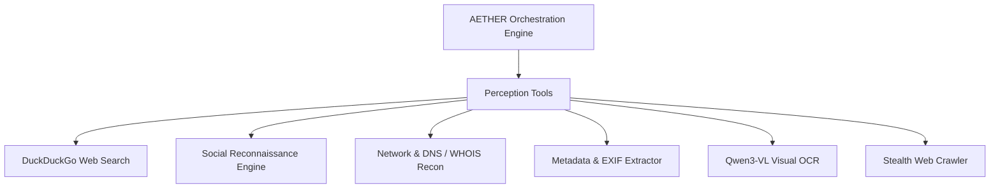

<div align="center">

# 🌐 AETHER
### Autonomous Extraction, Tactical Heuristic Exploration & Resolution
**Next-Generation Cyber Intelligence & Autonomous OSINT Operations Platform**

[](https://python.org)
[](https://fastapi.tiangolo.com)
[](https://ollama.com)
[-10b981?style=for-the-badge&logo=pytest&logoColor=white)](https://pytest.org)
[](LICENSE)

<br/>

[⚡ Live Web Dashboard](#-quickstart--launching) •
[🧠 Neural Architecture](#-neural-models--vram-arbitration) •
[🛠 Perception Tools](#-perception-layer--tooling) •
[📊 Interactive Graph](#-key-capabilities) •
[📖 API Reference](#-rest--websocket-api-reference)

<br/>

```ascii
     ___      ______ _____ _    _ ______ _____  
    / _ \    |  ____|_   _| |  | |  ____|  __ \ 
   / /_\ \   | |__    | | | |__| | |__  | |__) |
  / / _ \ \  |  __|   | | |  __  |  __| |  _  / 
 / / / \ \ \ | |____ _| |_| |  | | |____| | \ \ 
/_/ /   \_\_\|______|_____|_|  |_|______|_|  \_\
      AUTONOMOUS INTELLIGENCE ENGINE // v2.0
```

</div>

---

## 🌟 Executive Overview

**AETHER** is an enterprise-grade autonomous intelligence and open-source intelligence (OSINT) investigation framework. It replaces manual investigation workflows with a closed-loop multi-agent reasoning cycle:

$$\text{Observation} \longrightarrow \text{Graph-of-Thoughts Planning} \longrightarrow \text{Tool Execution} \longrightarrow \text{Adversarial Refutation} \longrightarrow \text{Dossier Synthesis}$$

Operating fully locally via **Ollama**, AETHER guarantees complete operational security (OPSEC) and data privacy while utilizing advanced uncensored neural reasoning models.

---

## 🧠 Neural Models & VRAM Arbitration

AETHER employs a specialized hierarchy of **6 local uncensored models**, dynamically arbitrated by a hardware-aware VRAM Lock manager to run on single-GPU systems (such as the NVIDIA RTX 4070 8GB VRAM):

| Model | Parameters | Role in AETHER | VRAM Lock |
| :--- | :---: | :--- | :---: |
| **`hermes-3.6-genesis:35b-a3b-uncensored-v7`** | **35B** | **Primary Deep Reasoner:** Abductive dead-end recovery & Executive Dossier synthesis | **Heavy Lock** |
| **`Gemma4-31B-QAT-Uncensored`** | **31B** | **Deep Fallback Reasoner:** Secondary heavy inference fallback | **Heavy Lock** |
| **`Gemma4-26B-A4B-QAT-Uncensored`** | **26B** | **Adversarial Red-Team Critic:** Skeptic fact verification ("Verification by Refutation") | **Heavy Lock** |
| **`Gemma4-12B-QAT-Uncensored`** | **12B** | **Fast Heuristic Planner:** Graph-of-Thoughts task decomposition & Entity resolution | *Light (Concurrent)* |
| **`Qwen3VL-8B-Uncensored`** | **8B** | **Vision / OCR:** Image text extraction, logo detection, and facial feature profiling | *Light (Concurrent)* |
| **`Gemma-4-E4B-Uncensored-Aggressive`** | **4B** | **Aggressive Tool Caller:** Rapid token parsing and entity normalization | *Light (Concurrent)* |

> **VRAM Arbiter:** Heavy models (≥ 26B) are strictly serialized through an async locking mechanism (`_heavy_model_lock`), completely preventing GPU Out-Of-Memory (OOM) crashes on 8GB VRAM hardware.

---

## 🎯 Key Capabilities

### 1. 🗂 Multi-Project Command Center & Batch Queueing
- Persistent project storage in JSON/SQLite across application restarts.
- **Sequential Batch Runner:** Queue multiple investigations to run one after another without manual supervision.
- Real-time status indicators (`IDLE`, `PLANNING`, `COLLECTING`, `REASONING`, `VERIFYING`, `COMPLETED`).

### 2. 📝 Target Intelligence Briefing Conditioning
- Provide user-defined intelligence context, suspected aliases, attack vectors, or investigative hypotheses when creating a project.
- The Planner, Abductive Engine, and Critic condition their strategies directly on this briefing to minimize search entropy and eliminate false positives.

### 3. 🌐 Real-Time Interactive Topology Graph (Cytoscape.js)
- Color-coded multi-entity visualization (`Person`, `Company`, `Domain`, `IP Address`, `Email`, `Social Handle`, `Artifact`).
- Concentric and physics-based force layouts.
- **Slide-Out Entity Inspector:** Inspect properties, confidence scores, and connection degrees with a single click.

### 4. ⚡ Live Execution Pipeline & AI Thought Stream
- 5-Phase visual stepper (`Planning` $\to$ `Collection` $\to$ `Abductive Reasoning` $\to$ `Adversarial Refutation` $\to$ `Synthesis`).
- **Live AI Consciousness Box:** Real-time stream of the LLM's internal monologue and strategic justifications.
- Chronological task history with elapsed durations, output previews, and Red-Team refutation verdicts (`CONFIRMED`, `PLAUSIBLE`, `REJECTED`).

---

## 🛠 Perception Layer & Tooling

AETHER features an extensible tool registry with automatic discovery:



- **`web_search`**: DuckDuckGo OSINT searching with automated entity extraction.
- **`social_recon`**: Multi-platform username correlation (GitHub, Twitter/X, Telegram, Reddit, LinkedIn).
- **`network_recon`**: DNS A/MX/TXT records, reverse IP lookups, WHOIS domain registrant analysis.
- **`vlm_processor`**: Optical character recognition (OCR) and visual profile analysis via local Qwen3-VL.
- **`metadata_extractor`**: File metadata, PDF headers, EXIF GPS coordinates extraction.
- **`stealth_crawler`**: Headless web page fetching and body parsing.

---

## 🚀 Quickstart & Launching

### 1. Prerequisites
- **Python 3.12+** or **Python 3.13**
- **[Ollama](https://ollama.com)** installed and running locally (`http://localhost:11434`)

### 2. Clone & Install
```bash
git clone https://github.com/ark4ng3l/aether.git
cd aether
pip install -r requirements.txt
```

### 3. Pull Required Ollama Models
```bash
# Deep Reasoning & Dossier Synthesis
ollama pull hermes-3.6-genesis:35b-a3b-uncensored-v7

# Fast Heuristic Planning
ollama pull hf.co/HauhauCS/Gemma4-12B-QAT-Uncensored-HauhauCS-Balanced:Q4_K_M

# Adversarial Red-Team Critic
ollama pull hf.co/HauhauCS/Gemma4-26B-A4B-QAT-Uncensored-HauhauCS-Balanced-MTP:Q4_K_M

# Vision / OCR
ollama pull hf.co/HauhauCS/Qwen3VL-8B-Uncensored-HauhauCS-Balanced:Q4_K_M
```

### 4. Launch AETHER Web Dashboard
```bash
python run.py --web
```
Open your browser at: **[http://127.0.0.1:8000](http://127.0.0.1:8000)**

### 5. CLI Mode (Terminal Investigation)
```bash
# Interactive Prompt
python run.py --cli

# Direct Seed Launch
python run.py --cli @target_username
python run.py --cli targetdomain.com
```

---

## 📡 REST & WebSocket API Reference

| Method | Endpoint | Description |
| :--- | :--- | :--- |
| `GET` | `/` | Serves Cyber OSINT Web Console |
| `GET` | `/api/health` | System health and Ollama status |
| `GET` | `/api/projects` | List all saved investigation projects |
| `POST` | `/api/projects` | Create a new project with context briefing |
| `GET` | `/api/projects/{id}` | Retrieve complete project detail & state |
| `PATCH`| `/api/projects/{id}` | Update project metadata or briefing notes |
| `DELETE`| `/api/projects/{id}` | Abort execution and delete project |
| `POST` | `/api/projects/{id}/run` | Launch investigation for a specific project |
| `POST` | `/api/projects/{id}/stop`| Abort active investigation |
| `POST` | `/api/projects/run-all` | Sequential batch run of all queued projects |
| `GET` | `/api/projects/{id}/graph` | Cytoscape-compatible node & edge graph |
| `GET` | `/api/projects/{id}/dossier` | Synthesized Markdown intelligence dossier |
| `GET` | `/api/projects/{id}/tasks` | Timeline of completed, active & pending tasks |
| `WS` | `/ws/{project_id}` | Real-time WebSocket event streaming |
| `WS` | `/ws/global` | Global project updates & AI thought stream |

---

## 🧪 Automated Testing Suite

AETHER comes with 100% test coverage across all sub-systems:

```bash
python -m pytest tests/ -v
```

```text
============================= test session starts =============================
platform win32 -- Python 3.13.15, pytest-9.1.1
collected 57 items

tests/test_entity_resolver.py (7 tests) .................... PASSED [ 12%]
tests/test_graph_store.py (7 tests) ........................ PASSED [ 24%]
tests/test_project_manager.py (7 tests) .................... PASSED [ 36%]
tests/test_reasoning.py (5 tests) .......................... PASSED [ 45%]
tests/test_registry.py (9 tests) ........................... PASSED [ 61%]
tests/test_server.py (11 tests) ............................ PASSED [ 80%]
tests/test_state.py (11 tests) ............................. PASSED [100%]

======================== 57 passed in 2.53s ========================
```

---

## 🔒 Security & OPSEC Notice

AETHER was engineered specifically for security researchers, penetration testers, OSINT analysts, and digital investigators:
- **Zero Cloud Leakage:** All LLM inference is processed completely locally via Ollama. No telemetry or target queries are transmitted to third-party APIs.
- **Deterministic Storage:** SQLite graph memory and Qdrant vector storage reside entirely within local directory paths (`data/`).

---

## 📜 License

This project is licensed under the **MIT License** — see the [LICENSE](LICENSE) file for details.

<div align="center">
<b>AETHER Autonomous Intelligence Platform</b> • Crafted for Advanced Digital Investigations
</div>
